=====================================
Adding new actions to the export menu
=====================================

:Authors: Laurent Goubet
:Contact: laurent.goubet@obeo.fr

.. include:: <isonum.txt>

Copyright |copy| 2007-2008, Obeo\ |trade|.

.. contents:: Table Of Contents

Source Code
-----------

To run the example or view the source code for this tutorial you can download the `example plugin 
<http://dev.eclipse.org/viewcvs/index.cgi/org.eclipse.emf/org.eclipse.emf.compare/examples/org.eclipse.emf.compare.examples.export.library/?root=Modeling_Project>`_
into your workspace and run it in a runtime workbench (see `Step 7`_). You will need to have an Eclipse up and running for EMF Compare for this code 
to compile.

What is the export menu, and why adding new export actions?
-----------------------------------------------------------

The export menu is the drop-down menu on the upper-right of EMF Compare GUI, using the classical floppy icon for a save action. On the image below, this
menu is expanded and shows only the default action, "As emfdiff".

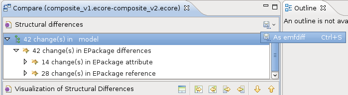

This menu allows users to save the comparison result. Adding actions there can be used to generate comparison reports easily. This tutorial will help
you set a reporting action for a custom meta-model. This action will be made transparent to other users and will only be shown when comparing models
from your own meta-model.

The example
-----------

The example used in this tutorial is an HTML export of a model representing a library. This tutorial will go through all the steps from defining
the meta-model to generating code and testing the custom export. If you simply wish to define the export extension point on one of your existing
models, Step directly to `Step 5`_ of this example.

Setting up the environment
--------------------------

This tutorial assumes you already have an Eclipse installed with EMF Compare up and running. See EMF Compare's `latest build 
<http://www.eclipse.org/modeling/emft/downloads/?project=compare>`_'s dependencies in order to achieve this.

For the purpose of the example you will need to create a new plug-in project:

 * Select the menu **File => New => Other...** then in the pop-up select the item **Plug-In Project** and click **Next**.
 * In this new window, fill in the plug-in name "*org.eclipse.emf.compare.examples.export.library*", leave the other fields as they are then select
   **Next**.
 * On this new page, tick **Generate an activator, [...]** and uncheck **This plug-in will make contribution to the UI** if it is checked.

The page should now look as shown on the image below. Select **Finish** to create this plug-in.

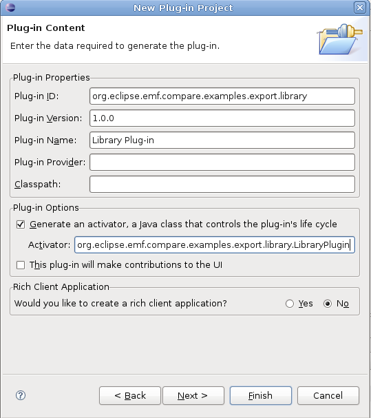

The PDE editor has opened to allow you to tweak the plugin's configuration (MANIFEST.MF and plugin.xml). Navigate to its "dependencies" tab and
click the **Add** button to add dependencies on the plugins listed on the image below.

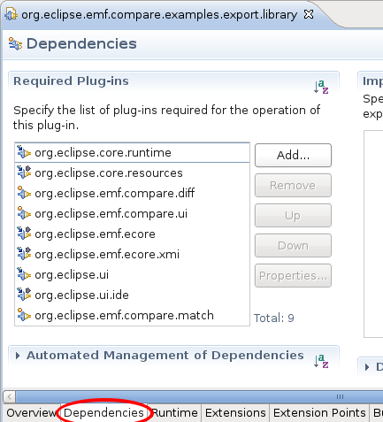

All of the manipulation we'll describe in this tutorial will be made within this project.

Step 1 : Designing the meta-model
---------------------------------

The first step is to design the meta-model for the models we wish to compare. In UML, the meta-model we'll consider looks like :

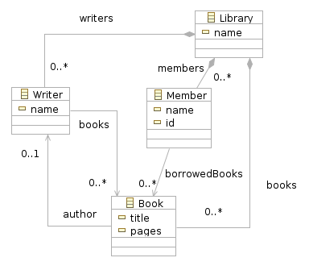

   Library Meta-Model

A library contains books, writers and members. Books have a title and a number of pages, and are linked to their author. Writers have a name and are 
linked to the books they have written. Members all have a name and an ID, and they can borrow any number of books.

Step 2 : Defining the meta-model
--------------------------------

EMF provides a number of ways to create this meta-model, yet this is out of the scope of this tutorial. EMF tutorials such as 
`Generating an EMF model <http://help.eclipse.org/help33/index.jsp?topic=/org.eclipse.emf.doc/tutorials/clibmod/clibmod.html>`_ can help you in 
going through this step.

The Ecore file for this meta-model is present in the example plugin and can be downloaded from the `CVS 
<http://dev.eclipse.org/viewcvs/index.cgi/org.eclipse.emf/org.eclipse.emf.compare/examples/org.eclipse.emf.compare.examples.export.library/model/library.ecore?revision=1.1&root=Modeling_Project>`_
with this tutorial and should look like :

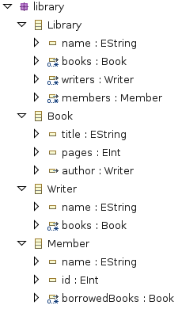

We suggest you create the model (or copy the provided file) in a "models" folder at the root of your plug-in project. We'll assume that you have
named your meta-model *library.ecore*.

Step 3 : Generating model code
------------------------------

Now that the meta-model has been created, we can proceed to generating its implementation.

 #) Right-click on *library.ecore* and select **New => Other...**.
 #) On the popup that just appeared, expand **Eclipse Modeling Framework** and select **EMF Model**. Click **Next**.
 #) Fill in the name *library.genmodel* for this new file and click **Next**.
 #) Select **Ecore model** and click **Next**.
 #) Click the **Load** button, if an error occurs, the model is not a valid EMF model. Revert to Step 2 and check that you correctly defined the
    meta-model. Click **Next** then **Finish** to create the genmodel for this model.
 #) On the editor that just opened, expand the root (first) node of the tree, and right click the *Library* node.
 #) Select **Show Properties View**. A new view should open on your environment.
 #) In the properties view, expand **All** and select **base Package**. Fill in *org.eclipse.emf.compare.examples.export* in its field, as on 
    |base package|
 #) Right click the root node of the tree.
 #) Successively select **Generate Model Code**, **Generate Edit Code** then **Generate Editor Code**.

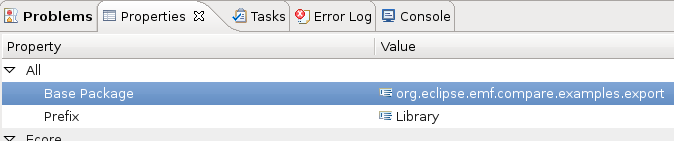

Two new packages, *org.eclipse.emf.compare.examples.export.library.impl* and *org.eclipse.emf.compare.examples.export.library.util*, have been generated
in your project. Besides, two new projects, **org.eclipse.emf.compare.examples.export.library.edit** and 
**org.eclipse.emf.compare.examples.export.library.editor** have been created in your workspace.

These newly generated packages and plug-ins correspond to the EMF code of the library meta-model and to a basic editor that can be used to created
library models. This editor will be used later to create the models that will be compared. By default, these models will use the extension 
*\*.library*.

Step 4 : Prototyping the export
-------------------------------

Let's define the prototype of the report we wish to create on library comparisons. For the purpose of this example, we'll create a simple HTML report
displaying the added and removed books and members, as well as the borrowed and returned books.

The HTML page will be divided in three. First will come a section for member movements (addition, deletion), then a second section will deal with the
catalog changes (new books, lost books), and a third section will report on borrowals and returns.

.. image:: ../images/ReportPrototype.png

We won't use code generators for this example and the HTML will then be mostly hard-coded with Strings and StringBuffers. This could be improved with
the use of `M2T languages <http://www.eclipse.org/modeling/m2t/>`_ but we won't get into these technologies here as they need tutorials of their own.

_`Step 5` : Designing the export action
---------------------------------------

We'll use a wizard-based action for our report exporting. Export actions must implement the interface *org.eclipse.emf.compare.ui.export.IExportAction*
which defines five methods:

 +------------------------------------------------+
 |void exportSnapshot(ComparisonSnapshot snapshot)|
 +------------------------------------------------+
 |Image getDisabledImage()                        |
 +------------------------------------------------+
 |Image getEnabledImage()                         |
 +------------------------------------------------+
 |String getText()                                |
 +------------------------------------------------+
 |String getToolTipText()                         |
 +------------------------------------------------+

 * *exportSnapshot* : This method is where the actual work of exporting the comparison result will be done. The parameter it is passed, *snapshot*,
   contains information about the match model and the differences model.
 * *getDisabledImage* : The Image returned by this method will be used as our action's icon when it is disabled.
 * *getEnabledImage* : As above, except this Image is used when the action is enabled.
 * *getText* : This is the text that will be displayed for our action. For example, the text of the default action shown on this tutorial's first image
   is "As emfdiff".
 * *getToolTipText* : The returned String will be used as a tooltip when the user hovers the mouse on our action.

We wish to create our report through a wizard. *exportSnapshot* will be used to initialize this wizard with the comparison result and opening it on
the user's interface. As for the icon, we'll use the same icon |actionicon| for both enabled and disabled state. This icon will be located in the 
*icons* folder of the plug-in.

.. |actionicon| image:: ../images/ActionIcon.gif

We'll create the action class in the package *org.eclipse.emf.compare.examples.export.library.action*. 

 #) Right-click on the root folder of the plugin *org.eclipse.emf.compare.examples.export.library*.
 #) Select **New => Folder** and set its name to "icons".
 #) Copy the icon for your action (either the one above, or one you've selected) to this new directory
 #) Right-click on the *src* folder of the plugin.
 #) | Select **New => Package** and fill in its name as on the image below
    | |NewPackage|
 #) Right-click this new package and select **New => Class**.
 #) Fill in the name of the class to "LibraryExportAction".

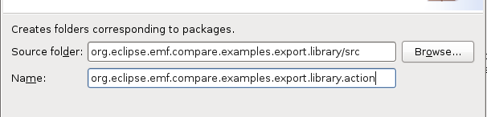

The java editor should have opened on your new Class. Paste the code below as the code of this action class::

 public class LibraryExportAction implements IExportAction {
	private final String text;
	private final String toolTipText;
	private final Image image;
	
	public LibraryExportAction() {
		text = "Library report";
		toolTipText = "Exports library comparison result as a report";
		final URL imageURL = LibraryPlugin.getPlugin().getBundle().getEntry("icons/libraryexport.gif");
		image = ImageDescriptor.createFromURL(imageURL).createImage();
	}
	
	public String getText() {
		return text; 
	}

	public String getToolTipText() {
		return toolTipText;
	}

	public Image getDisabledImage() {
		return image;
	}

	public Image getEnabledImage() {
		return image;
	}

	public void exportSnapshot(ComparisonSnapshot snapshot) {
		final LibraryExportWizard wizard = new LibraryExportWizard();
		final IWorkbench workbench = PlatformUI.getWorkbench();
		
		wizard.init(workbench, snapshot);
		final WizardDialog dialog = new WizardDialog(workbench.getActiveWorkbenchWindow().getShell(), wizard);
		dialog.open();
	}
 }

All needed variables are initialized within the default constructor with static values :
 * **text** will hold the text displayed as the action's "name".
 * **toolTipText** will be shown as the tool tip when hovering the mouse over the action.
 * **image** is statically created from the image "*libraryexport.gif*" in the "*icons*" folder and will be used as the action's icon.

The method *exportSnapshot* is implemented by creating a custom wizard and passing it the snapshot via its *init* method. We need to create this
wizard : repeat the steps above to create a package named "org.eclipse.emf.compare.examples.export.library.wizard" alongside the "\*.action" one.
Once done, copy the two classes `LibraryExportWizard 
<http://dev.eclipse.org/viewcvs/index.cgi/org.eclipse.emf/org.eclipse.emf.compare/examples/org.eclipse.emf.compare.examples.export.library/src/org/eclipse/emf/compare/examples/export/library/wizard/LibraryExportWizard.java?revision=1.1&root=Modeling_Project>`_
and `LibraryExportWizardPage 
<http://dev.eclipse.org/viewcvs/index.cgi/org.eclipse.emf/org.eclipse.emf.compare/examples/org.eclipse.emf.compare.examples.export.library/src/org/eclipse/emf/compare/examples/export/library/wizard/LibraryExportWizardPage.java?revision=1.1&root=Modeling_Project>`_
within this new package.

**LibraryExportWizardPage** is the page that will be displayed by the wizard. It allows us to define our own validation rules::

 protected boolean validatePage() {
	boolean result = super.validatePage();
	if (result) {
		final String fileName = getFileName();
		if (fileName.endsWith(".html")) {
			setErrorMessage(null);
			return true;
		}
		setErrorMessage("File name must end in '.html'");
		return false;
	}
	// This will return false
	return result;
 }

Our page will then be valid if and only if the file the user has chosen ends with the extension "\*.html". The wizard will output an error message
and prevent file creation otherwise.

**LibraryExportWizard** is the core of our export action. This wizard will take care of creating the result file and generating the HTML code within 
it. Let's take a more detailed look at its methods of interest.

 * *performFinish* : This is the method that will be called by Eclipse when the user clicks on **Finish** on a valid page of our wizard. This is where
   we create the buffer in which the HTML code will be generated. It delegates the generation to several private methods that are used to generate 
   sections of the HTML page.
 * *generateCSS* : This method will be called to create a basic CSS style for our HTML page. Tweak this to modify the colors, background, foreground,
   ... of the result.
 * *generateXXXTable* : These are the methods used to generate the six HTML tables of our report. Let's detail *generateReturnedTable* which is used
   to generate the HTML table displaying to the user the books that have been returned::

    private String generateReturnedTable() {
    	String returnedBooks = new String();
    	final TreeIterator<EObject> iterator = input.getDiff().eAllContents();
    	while (iterator.hasNext()) {
    		final EObject next = iterator.next();
    		if (next instanceof RemoveReferenceValue) {
    			final EReference target = ((RemoveReferenceValue)next).getReference();
    			if (target.getFeatureID() == LibraryPackage.MEMBER__BORROWED_BOOKS) {
    				// We need to create the table headers
    				if (returnedBooks.length() == 0) {
    					returnedBooks += "<table><tr>";
    					returnedBooks += "<td class=\"header\" colspan=\"2\">Returned Books</td></tr>";
    					returnedBooks += "<tr><td class=\"header\">Title</td><td class=\"header\">Member</td></tr>";
    				}
    				final Book returned = (Book)((RemoveReferenceValue)next).getRightRemovedTarget();
    				final Member member = (Member)((RemoveReferenceValue)next).getRightElement();
    				returnedBooks += "<tr><td>";
    				returnedBooks += returned.getTitle();
    				returnedBooks += "</td><td>";
    				returnedBooks += member.getName();
    				returnedBooks += "</td></tr>";
    			}
    		}
    	}
    	// Closes the table if we found returned books
    	if (returnedBooks.length() > 0)
    		returnedBooks += "</table>";
    	return returnedBooks;
    }

   What does this code do? It iterates over the whole differences model (*input.getDiff().eAllContents()* creates an iterator over direct and
   indirect children of the DiffModel) and searches for elements corresponding to removed references (*RemoveReferenceValue*). For each of these
   removals, we'll check that the target reference is **borrowedBooks** of the class "Member". When we find such a reference, we'll create an
   HTML table containing the title of the returned book and the name of the member that had borrowed it.

Now that we have both defined the classes backing up our export action and the model's code, we can set the extension point to provide EMF Compare
with our report action.

Step 6 : Providing the export action
------------------------------------

Export actions can be added through the extension point *org.eclipse.emf.compare.ui.export*. This extension point accepts three parameters, two of 
which being mandatory. **id** is the unique identifier of your extension, **class** is the fully qualified name of the action class implementing
*org.eclipse.emf.compare.ui.export.IExportAction*. The third -and optional- parameter is the file extension on which this export action will be 
enabled. We've prepared all of the required classes in the above steps; let us now configure this extension point:

 #) Double-click on the file **META-INF/MANIFEST.MF** of the *org.eclipse.emf.compare.examples.export.library* plugin.
 #) | Select the **extensions** tab
    | |extensiontab|
 #) Click on **Add**, select the extension point *org.eclipse.emf.compare.ui.export* and click **Finish**.
 #) On the right part of the editor now appear three fields labeled *ID*, *class* and *fileExtension* corresponding to the parameters described
    above.
 #) Fill in the ID with a unique identifier (leaving it as-is should be enough).
 #) Click on **Browse...** and enter the name of the action Class "*LibraryExportAction*"; select it on the lower part and click **OK**.
 #) Set the fileExtension to be *library*. The tab should now look like |exportextension|

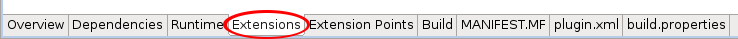
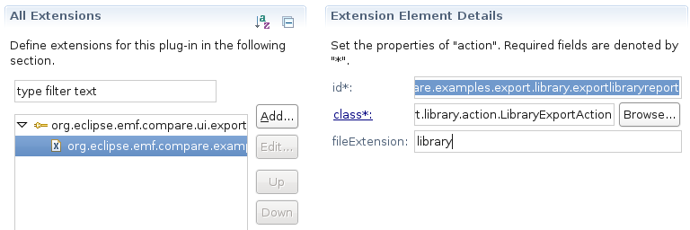

That's it! Your export action will now be automatically added to the export menu of EMF Compare's GUI for each "library" file comparison.

_`Step 7` : Testing the export action
-------------------------------------

You will need to launch a runtime workbench to test your action. Expand the menu **Run** and select **Open Run Dialog...**, double click "Eclipse
Application" and click **Run**.

A new, empty workbench should have opened. Select **New => Other... => Plugin Project** and name this project "library.test". Click **Finish** to 
create the project we'll use to test all of the code we prepared earlier.

 #) Right-click on the project and select **New => Other...**.
 #) Expand **Example EMF Model Creation Wizard**.
 #) You should see an element **Library Model** in this category. Select it and click **Next**.
 #) Name your library model *v1.library* and click **Next**.
 #) This page prompts you for the *Model Object*, select **Library** and click **Finish**.

You can now create the first version of the library model. Create some Writers, Members and Books, set some borrowals, then copy/paste your model,
naming the new one *v2.library* and make modifications to this new version (you can also commit the model on SVN/CVS, the goal of this operation is
to have the first version saved somewhere while still modifying another version of it).

If you used the meta-model provided in Step 2 for the generation, the `samples folder
<http://dev.eclipse.org/viewcvs/index.cgi/org.eclipse.emf/org.eclipse.emf.compare/examples/org.eclipse.emf.compare.examples.export.library/model/samples/?root=Modeling_Project>`_
of the CVS contains two versions of a sample library.

You now need to tell EMF Compare that library files should be compared as models. See the `EMF Compare FAQ 
<http://wiki.eclipse.org/EMF_Compare_FAQ#Which_files_should_be_compared_via_EMF_Compare_.3F>`_ to achieve this. 

You can now launch a comparison of your libraries by selecting both models, then selecting **Compare With => Each Other** as shown below

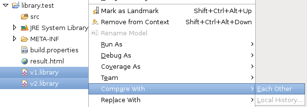

You should now be looking at the comparison result of your two models through EMF Compare's GUI. Expanding the export menu should display the **library
report** action as shown below. This action will not be displayed to the user when comparing files of an extension distinct from *\*.library*.

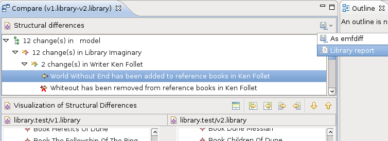

Selecting this action will make the new file wizard pop up with **result.html** as the default name for the result. Select the folder where you wish
the report created, then click **Finish**. The file has now been created in the selected folder. Double click on it to see the report about this 
particular comparison. If you have used the two library models provided in the zip file above, the report looks like :

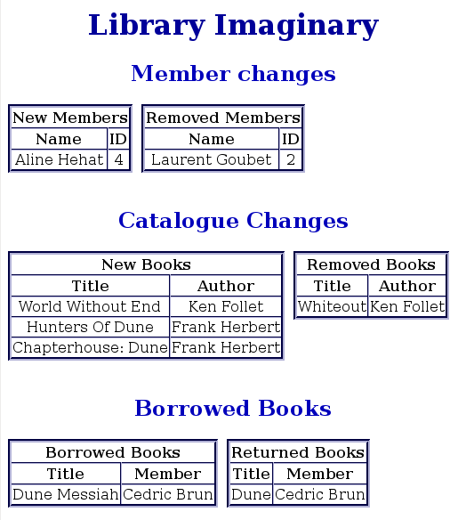

You are now ready to customize this sample report, or to define your own!
